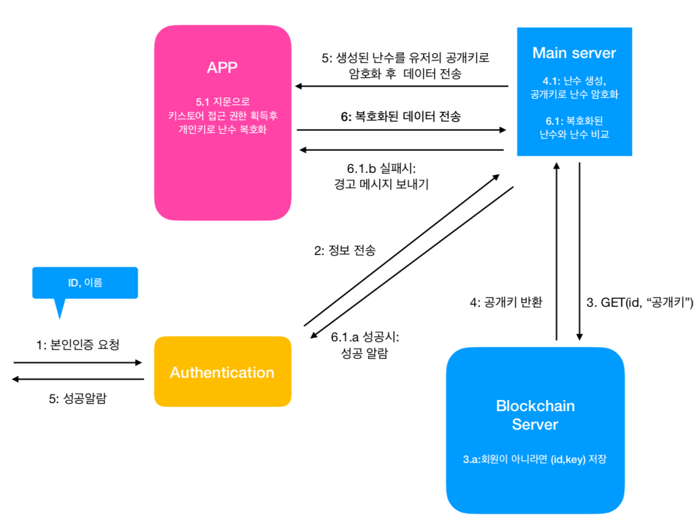

# Onece

컴퓨터 캡스톤 디자인: 블록체인을 활용한 본인 인증 시스템

 사용 기술 : Node.Js, Hyperledger Fabric, Google firebase database, Android java

사용 시나리오 1. 회원가입

안드로이드 Keystrore를 이용해서 RSA공개키 쌍을 생성한 후에
블록체인 서버에 공개키 등록

사용 시나리오 2. 본인인증

사용자가 본인인증 요청시 구글 파이어베이스를 이용, 사용자에게게 푸시메세지와 인증데이터 전송
사용자는 받은 메세지 터치후 본인인증(지문인식) -> keyStrore에 저장된 개인키로 인증데이터 인증후 firebase data베이스에 해당 데이터 등록

